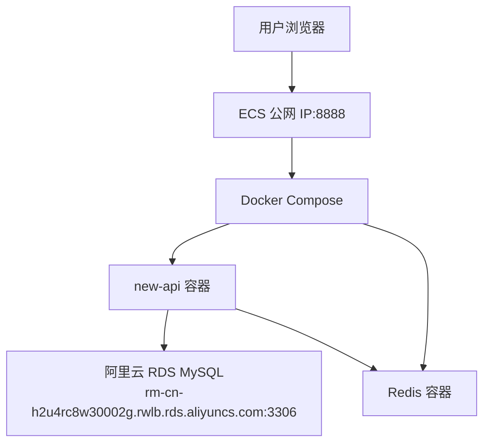

# 阿里云 ECS 部署说明

本文档用于在阿里云 ECS 上用 Docker Compose 部署 new-api，并连接阿里云 RDS MySQL。

## 部署拓扑



## 已配置项

- `docker-compose.yml` 已切到生产部署结构：`new-api` 容器连接外部 RDS，Redis 在本机容器中运行。
- `.env` 已写入 RDS 连接信息、Redis 密码、`SESSION_SECRET`、节点名和镜像名。
- `.env` 已在 `.gitignore` 中，避免把敏感信息提交到仓库。

RDS 连接串当前使用数据库名 `new-api`：

```text
new_api:<password>@tcp(rm-cn-h2u4rc8w30002g.rwlb.rds.aliyuncs.com:3306)/new-api?charset=utf8mb4&parseTime=true&loc=Local
```

如果 RDS 上实际数据库名不是 `new-api`，修改 `.env` 中 `SQL_DSN` 斜杠后的数据库名。

## 解决 Docker Hub 拉取失败

已配置镜像加速器地址：

```text
https://amuntpc9.mirror.aliyuncs.com
```

在 ECS 项目根目录执行：

```bash
chmod +x deploy/aliyun/configure-docker-mirror.sh
sudo ./deploy/aliyun/configure-docker-mirror.sh
```

脚本会：

- 备份已有 `/etc/docker/daemon.json`
- 写入 `registry-mirrors`
- 执行 `systemctl daemon-reload`
- 重启 Docker
- 输出 `docker info` 中的镜像加速器配置

## 启动

```bash
docker compose pull
docker compose up -d
docker compose ps
docker compose logs -f new-api
```

如果使用旧版本 Compose：

```bash
docker-compose pull
docker-compose up -d
```

## ECS 和 RDS 检查

- ECS 安全组放行 TCP `8888`，或者只放行给反向代理所在机器。
- RDS 白名单放行 ECS 内网 IP。
- RDS 中需要提前存在 `.env` 里配置的数据库。
- 如果 ECS 和 RDS 在同一 VPC，优先确认该 RDS 地址能从 ECS 访问。

## 回滚到本地数据库

当前生产 compose 不再启动 PostgreSQL。需要本地数据库调试时，用 `docker-compose.dev.yml`，不要改生产 compose。
